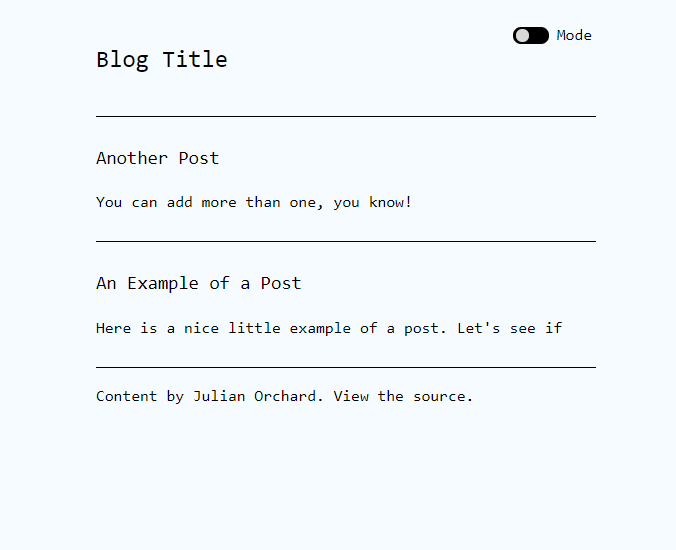
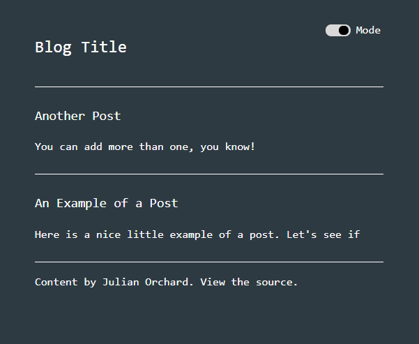

#### Note 2022-08-16: Archiving this because I now use [a bash tool](https://github.com/julianorchard/julianorchard.github.io) instead, or even just org-mode

# Clog: Command Line blOG

  
  

A static site generator written in Perl. Posts written in markdown.
URL's are formatted /posts/YYYY-mm-dd-title-of-post.html. It makes it really
nice to update a blog from the web server
command line.

## Benefits

- ~~Simple and easy to use~~
- ~~Edit with vim and markdown~~
- ~~Fairly SEO friendly~~
- ~~Designed to be fast loading~~
- ~~Sensible CSS defaults~~
- I didn't have to learn how to use someone else's
  static site generator (also, all of the above)

## Usage

Keep the script in the site root directory to make
things simple.

- `./clog add` add a new post

- `./clog publish` publish the post you added

- `./clog update` update the index.html page

- `./clog updateall` updates every page on the site
(use this if you're updating the html or css elements in
the `src` folder)

- `./clog rm` remove a post from posts/

- `./clog setup` add a title and description to the
blog

## Todo

- [x] global update all function
- [ ] should be able to select a post to edit
- [ ] timestamp the edit of the post?
